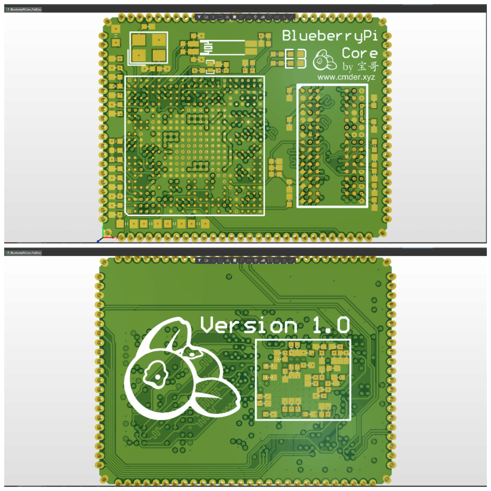

# 造“派”计划

下图为BlueberryPi1  

下图为BlueberryPi-Core

## 0.关于本项目

当我看到树莓派4b的那一刻起，我就对这个卡片大小的单板计算机深深的吸引，漂亮的布局、完整的功能...我能不能自己也做一个呢？  

这就是造“派”计划的由来。本人通过四处搜寻资料以及在[这个项目](https://oshwhub.com/logicworld/h6_board)的指引下，成功画出了**BlueberryPi 1**，又在自学Altium Designer后画了它的核心板**BlueberryPi-Core**（时间原因还没调试）。  

我的“蓝莓派”是一板成功的，但是也免不了这一路上的曲折，中途因为短路等各种原因焊废了好几块板子，导致我一度怀疑人生。好在功夫不负有心人，当电源小灯亮起来，屏幕上出现Ubuntu界面的时候，我知道我成功了。  

## 1.硬件打样说明

电路板Gerber文件为Hardware文件夹下的zip压缩包。BlueberryPi 1中的文件请使用嘉立创eda（专业版）打开，BlueberryPi-Core中的文件请使用Altium Designer打开，可以直接上传到嘉立创平台进行打样。  

## 2.镜像烧录说明

BlueberryPi 1目前使用的是香橙派官方的镜像文件[这是网址](http://www.orangepi.cn/html/hardWare/computerAndMicrocontrollers/details/Orange-Pi-3-LTS.html)（蓝莓版镜像待移植）。下载好镜像后可以使用balenaEtcher将镜像烧录至TF卡中。  

我还为立创泰山派移植了蓝莓版Ubuntu20.04桌面系统，Bootloader和Kernel放在了对应的文件夹下，大家可以根据需要下载，完整的镜像文件待我修正好一些小bug后会上传。下载好镜像后可以使用balenaEtcher将镜像烧录至TF卡中，也可使用瑞芯微烧录工具下载到板载EMMC中。  

## 3.硬件使用说明

- BlueberryPi 1使用说明：将烧录好镜像文件的TF卡插入TF卡槽内，micro-usb接通5V-2A的电源后即可通过串口/HDMI连接使用。  

- BlueberryPi-Core使用说明：参考全志官方/香橙派/BlueberryPi 1中的原理图，绘制底板后，将BlueberryPi-Core贴至底板上使用（待测试）。  
